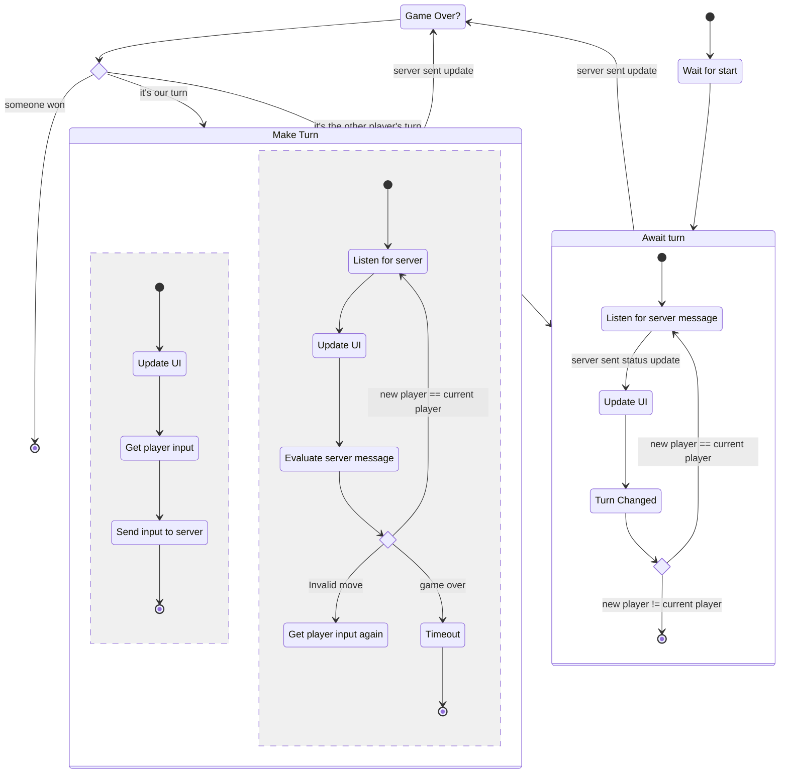

# Client

```mermaid
stateDiagram-v2

gameOver : Game Over?
state isGameOver <<choice>>

s0 : Wait for start

s1 : Await turn
state s1 {
    s1Listen : Listen for server message
    s1Turn : Turn Changed
    s1Update : Update UI
    state s1condition <<choice>>

    [*] --> s1Listen
    s1Listen --> s1Update : server sent status update
    s1Update --> s1Turn
    s1Turn --> s1condition
    s1condition --> s1Listen : new player == current player
    s1condition --> [*] : new player != current player
}

s2 : Make Turn
state s2 {
    s2Input : Get player input
    s2SendInput : Send input to server
    s2Listen : Listen for server
    s2Eval : Evaluate server message
    s2Update : Update UI
    s2Update2 : Update UI
    state s2condition <<choice>>

    [*] --> s2Update2
    s2Update2 --> s2Input
    s2Input --> s2SendInput
    s2SendInput --> [*] 
    --
    s2Input2 : Get player input again
    [*] --> s2Listen
    s2Listen --> s2Update
    s2Update --> s2Eval
    s2Eval --> s2condition
    s2condition --> s2Listen : new player == current player
    s2condition --> s2Input2 : Invalid move
    s2condition --> Timeout : game over 
    Timeout --> [*]
}

[*] --> s0
s0 --> s1
s1 --> gameOver : server sent update
gameOver --> isGameOver
isGameOver --> s2 : it's our turn
isGameOver --> s1 : it's the other player's turn
isGameOver --> [*] : someone won
s2 --> gameOver : server sent update

```