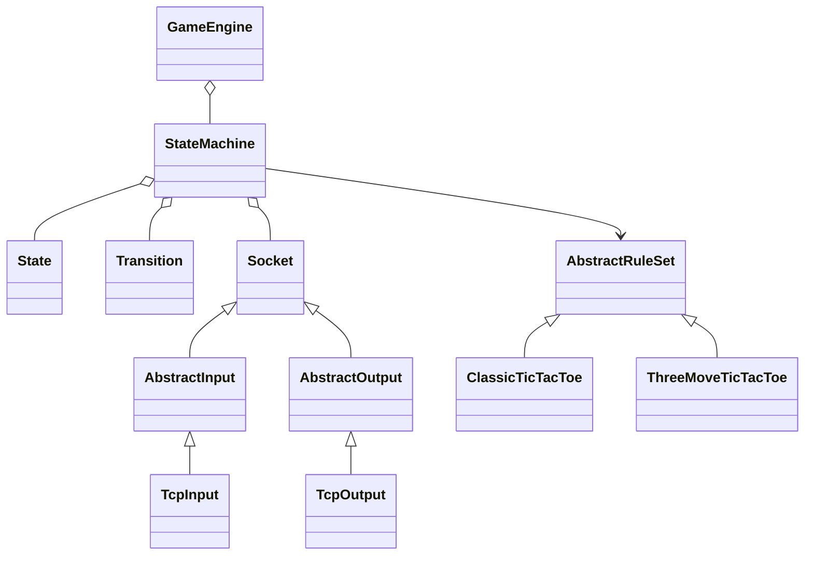

# Server: Classes

```mermaid
classDiagram

class GameEngine
class State
class Transition
class StateMachine
class Socket
class AbstractInput
class TcpInput
class AbstractOutput
class TcpOutput
class AbstractRuleSet
class ClassicTicTacToe
class ThreeMoveTicTacToe

AbstractRuleSet <|-- ClassicTicTacToe
AbstractRuleSet <|-- ThreeMoveTicTacToe

GameEngine o-- StateMachine
StateMachine o-- State
StateMachine o-- Transition
StateMachine --> AbstractRuleSet

Socket <|-- AbstractInput
Socket <|-- AbstractOutput
AbstractInput <|-- TcpInput
AbstractOutput <|-- TcpOutput
StateMachine o-- Socket

```