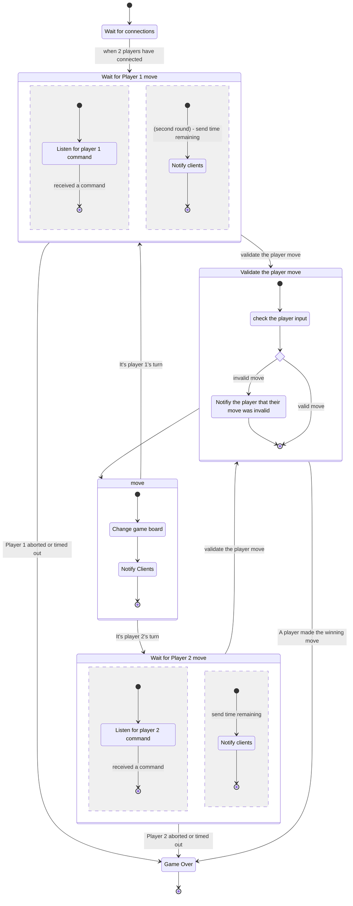

# Server
## Game statemachine

```mermaid
stateDiagram-v2

wait : Wait for connections
player1Move : Wait for Player 1 move
state player1Move {
    p1listen : Listen for player 1 command
    [*] --> p1listen
    p1listen --> [*] : received a command
    --
    p1Notify : Notify clients
    [*] --> p1Notify : (second round) - send time remaining
    p1Notify --> [*]
}

player2Move : Wait for Player 2 move
state player2Move {
    p2listen : Listen for player 2 command
    [*] --> p2listen
    p2listen --> [*] : received a command
    --
    p2Notify : Notify clients
    [*] --> p2Notify : send time remaining
    p2Notify --> [*]
}

gameOver : Game Over
change : Change game board

[*] --> wait
wait --> player1Move : when 2 players have connected

player1Move --> validate : validate the player move
state move {
    mNotify : Notify Clients
    [*] --> change
    change --> mNotify
    mNotify --> [*]
}
player1Move --> gameOver : Player 1 aborted or timed out

move --> player2Move : It's player 2's turn

player2Move --> validate : validate the player move
player2Move --> gameOver : Player 2 aborted or timed out
validate --> gameOver : A player made the winning move

move --> player1Move : It's player 1's turn

validate : Validate the player move
state validate {
    rules : check the player input
    notifyInvalid : Notifiy the player that their move was invalid
    state isValid <<choice>>
    [*] --> rules
    rules --> isValid
    isValid --> notifyInvalid : invalid move
    notifyInvalid --> [*]
    isValid --> [*] : valid move
}
validate --> move
gameOver --> [*]
```